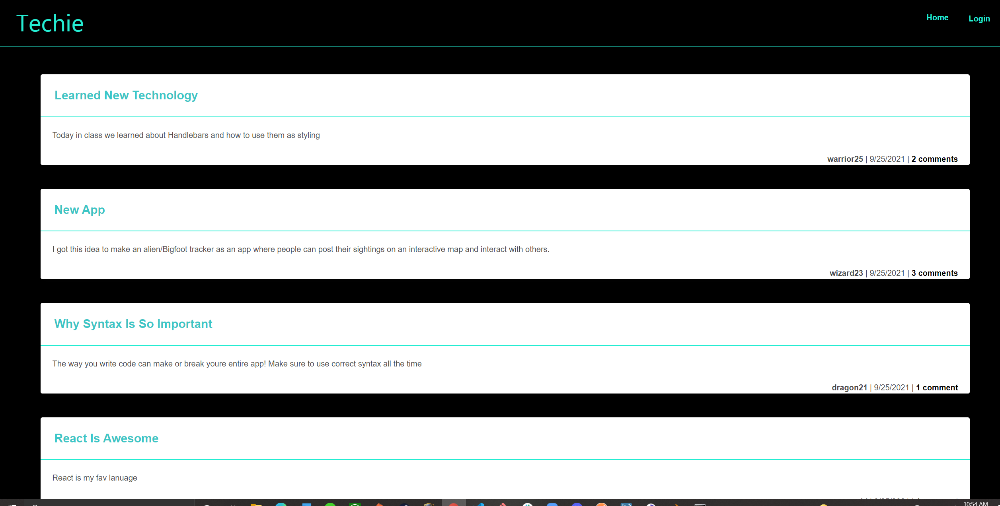

# Techie

A tech blog for developers to write about their knowledge and passion for tech. Following the MCV paradigm, this app uses mySQL and sequelize databases, handlebars for the layout and express.js and API routes.

Users are able to create their own accounts where they can create, update and delete their own posts and comment on other users' posts.

## Links
Deployed App on Heroku: https://safe-refuge-93093.herokuapp.com/
Github: https://github.com/lhaykus/Techie-Blog

- [App](#app)
- [Built With](#built-with)
- [Installation](#installation)
- [Usage](#usage)


# App




## Built With

* mySQL
* Sequelize
* express-handlebars
* express.js
* Javascript ES6
* Node.js


## Installation
To use this app 
* Clone or fork this repositiory
* *Npm i* to install all the needed packages 
## Usage
To start using this blog first set up the database
Run the following in the termianl.
```
mysql -u root -p

```
Then enter the password

```
DROP DATABASE IF EXISTS techblog_db;
CREATE DATABASE techblog_db;

```
Then, seed the data 
```
npm run seed
```
Then start the app!
```
npm start
```


